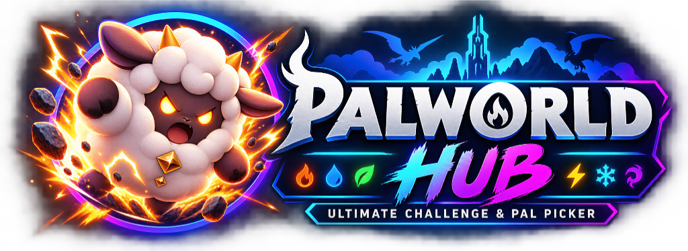
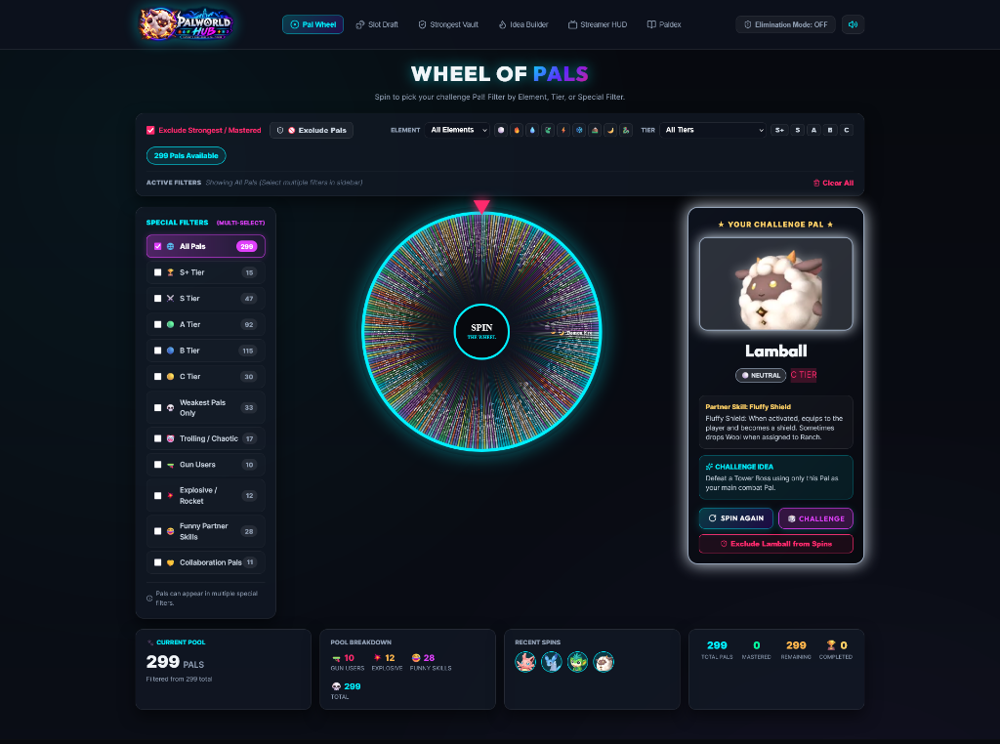
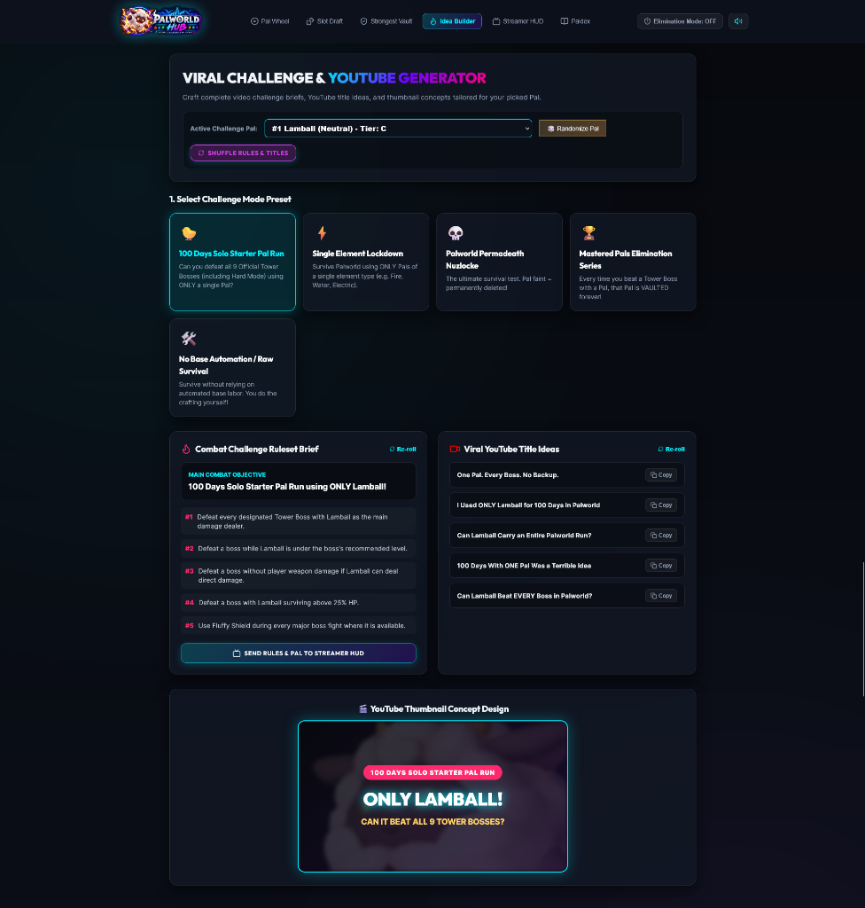
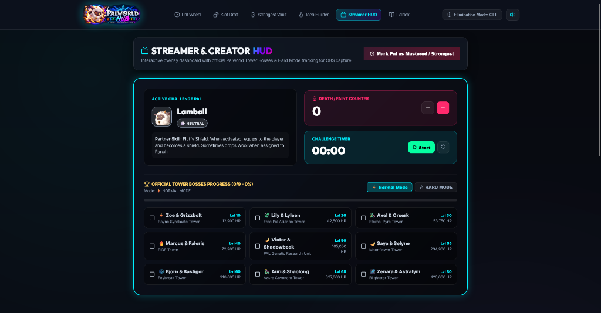

<div align="center">



<br/><br/>


### Created & Developed by **OVIVEKO**

[](mailto:workforoviveko@gmail.com)
[](https://github.com/oviveko-dev)
[](https://x.com/OVIVEKO)
[](https://www.youtube.com/@oviveko)

[](https://reactjs.org/)
[](https://vitejs.dev/)
[](LICENSE)
[](https://palworld.fandom.com/)

</div>

---

## 🌐 Live Website & Demo
👉 **[https://palworld-challenge-hub.vercel.app/](https://palworld-challenge-hub.vercel.app/)**

---

A feature-rich, high-performance web application designed for **Palworld Content Creators, Streamers, and Hardcore Challenge Players** to pick Pals, build combat challenges, draft teams, and track mastered Pals!

---

## 📸 Application Screenshots

### 🎡 1. Interactive Wheel of Pals Dashboard


### ⚔️ 2. Viral Challenge & YouTube Idea Generator


### 📺 3. Streamer & Creator HUD (Tower Boss Tracker)


---

## 🌟 Key Features

### 🎡 1. Interactive Wheel of Pals (Studio Dashboard)
- **3-Column Dashboard Layout**: Special Filters sidebar, glowing HTML5 Canvas spin wheel, and Hero Pal Challenge card.
- **299 Paldeck Dataset**: Complete dataset including all original Pals and 11 Terraria Crossover Collaboration Pals.
- **Official Palworld Artwork**: Live high-resolution WebP icons for every Pal.
- **Authentic Partner Skills**: Detailed Partner Skill names and full mechanical effect descriptions.
- **Multi-Select Filters**: Combine multiple filters simultaneously (e.g. `Gun Users` 🔫 + `Trolling / Chaotic` 🤡 + `S+ Tier` 🏆 + `Collaboration Pals` 🤝).
- **🚫 Pal Excluder System**: Search and exclude specific Pals from wheel spins, with quick one-click exclude on the winner card.
- **Default Startup Pal**: Initialized with `#1 Lamball` for immediate rich presentation.

### ⚔️ 2. Viral Challenge & YouTube Idea Generator
- **5 Combat-Focused Presets**:
  1. *100 Days Solo Starter Pal Run* 🐤
  2. *Single Element Lockdown* ⚡
  3. *Palworld Permadeath Nuzlocke* 💀
  4. *Mastered Pals Elimination Series* 🏆
  5. *No Base Automation / Raw Survival* 🛠️
- **Dynamic Placeholders**: Automatically replaces `{PAL_NAME}`, `{ELEMENT}`, and `{PARTNER_SKILL}` with active Pal attributes.
- **Randomized Combat Rules & Titles**: 15 combat rules and 15 viral YouTube titles per preset with a **🎲 Re-roll** button.
- **Thumbnail Concept Mockup**: 16:9 YouTube thumbnail preview generator.

### 🛡️ 3. Strongest & Mastered Vault
- **Mastered Pal Tracking**: Exclude completed/mastered Pals from future draws.
- **➕ Add Pal to Vault**: Search any Pal from Paldeck or create custom/modded Pals with custom stats and artwork.
- **JSON Import / Export**: Save and load your Mastered Vault state across devices.

### 🎰 4. Multi-Reel Slot Draft
- **3-Reel Pal Slot Machine**: Spin multi-reel drafts to pick your 3-Pal party for boss fights.

### 📺 5. Streamer HUD & Tower Boss Tracker
- **9 Official Tower Bosses**: Complete stats and HP for Normal and Hard Mode Tower Bosses.
- **Stream Overlay Mode**: Transparent HUD mode tailored for OBS/Streamlabs overlay integration.

### 📖 6. Searchable Paldex Explorer
- Search and filter all 299 Pals by Element, Combat Tier, and Special Filters.

---

## 🛠️ Technology Stack

- **Frontend Framework**: React 18
- **Build Tool**: Vite
- **Icons**: Lucide React
- **Effects**: Canvas Confetti & HTML5 Canvas
- **Audio**: Web Audio API (Procedural sound ticks & victory fanfare)
- **Styling**: Vanilla CSS3 (Custom Glassmorphism, Dark Neon Cyberpunk Design Tokens)

---

## 🚀 Quick Start & Local Setup

### Prerequisites
- [Node.js](https://nodejs.org/) (v18 or higher recommended)
- `npm` or `yarn`

### Installation Steps

1. **Clone the Repository**:
   ```bash
   git clone https://github.com/oviveko-dev/palworld-challenge-hub.git
   cd palworld-challenge-hub
   ```

2. **Install Dependencies**:
   ```bash
   npm install
   ```

3. **Start Development Server**:
   - **Method A (1-Click Windows Batch)**: Double click `run.bat`
   - **Method B (Terminal)**: Run `npm run dev`
   
   Open your browser at `http://localhost:5173/`.

4. **Build Production Bundle**:
   ```bash
   npm run build
   ```

---

## 📤 Push to GitHub

To push updates to your GitHub repository:

```bash
# 1. Stage all project files
git add .

# 2. Commit changes
git commit -m "Add application screenshots to README.md"

# 3. Push to GitHub main branch
git push -u origin main
```

---

## 📄 License

This project is created by **[OVIVEKO](https://github.com/oviveko-dev)** under the [MIT License](LICENSE).
Palworld assets belong to Pocketpair, Inc.
